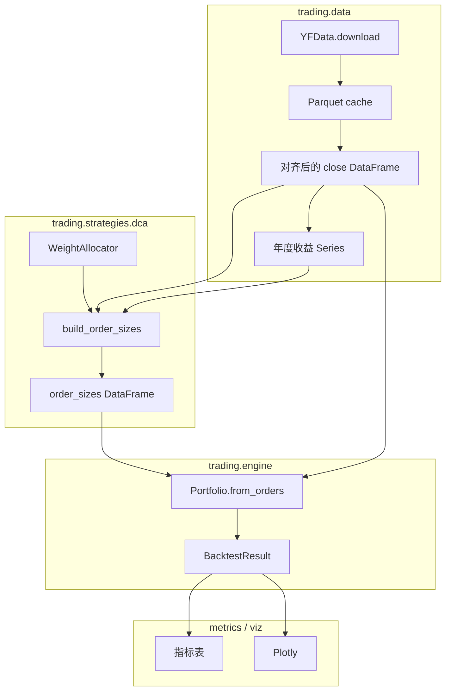

# Trading — 回测策略引擎

基于 **vectorbt** 的月度定投回测：可插拔的权重分配器、与多条 baseline 在同一日历与资金约束下对比、量化指标汇总，以及基于 **Plotly** 的多图报告与 Jupyter 探索。本文档面向**使用**与**二次开发**。

---

## 1. 功能概览

| 能力 | 说明 | 主要入口 |
|------|------|----------|
| 定投策略制定 | 标的、区间、月预算、默认权重；按「年」调用分配器得到当月目标权重，再折算为股数订单 | `DCAParams`、`build_order_sizes`、`run_dca_portfolio` |
| Baseline 对比 | 与主策略共用对齐后的行情、相同 `monthly_budget` 与 `total_invested` | `run_scenarios` |
| 量化分析 | CAGR、回撤、年化波动、夏普/索提诺、Calmar；可选合并 vectorbt `stats`；相对基准终值比 | `portfolio_metrics_row`、`compare_portfolios` |
| 多维度可视化 | 净值/回撤/超额、年度权重柱状堆叠、月度收益热力图、滚动夏普、总览子图 | `trading/viz.py`、`scripts/generate_report.py` |
| 策略规格抽象 | 用统一 `StrategySpec` 描述策略，便于批量实验与后续 LLM 生成 | `trading/specs.py` |
| 批量实验与排名 | 多策略一键回测、导出汇总与排名表，支持 prompt/spec-file 输入 | `trading/experiment.py`、`scripts/run_experiments.py` |

---

## 2. 仓库与包结构

```
Trading/
├── pyproject.toml          # 发行名 trading-backtest；可编辑安装后 import 仍为 trading
├── requirements.txt
├── trading/                # 核心库（Python 包名 trading）
│   ├── __init__.py         # 对外 re-export 常用符号
│   ├── data.py             # 行情下载、年度收益、定投日、Parquet 缓存
│   ├── engine.py           # BacktestResult、portfolio_from_orders、run_dca_portfolio、run_scenarios
│   ├── scenario_context.py # ScenarioContext、BaselineBuilder 协议
│   ├── baseline_builders.py # monthly_full_invest、lump_sum_first_day 等工厂与 default_baseline_builders_v1
│   ├── metrics.py          # 净值序列、指标行/表、超额序列
│   ├── specs.py            # StrategySpec、preset 模板、自然语言转策略草案（MVP）
│   ├── experiment.py       # run_experiment(s)、分配器注册、策略排名
│   ├── viz.py              # Plotly 图形与 HTML/PNG 写出
│   └── strategies/
│       └── dca.py          # DCAParams、WeightAllocator、订单构造、内置分配器
├── examples/
│   └── dynamic_dca_vectorbt.py
├── scripts/
│   ├── generate_report.py
│   └── run_experiments.py
├── notebooks/
│   └── backtest_explore.ipynb
├── data/
│   ├── cache/              # 收盘价 Parquet（gitignore，运行期生成）
│   └── pulling.py        # 历史草稿，与引擎无耦合；新逻辑请用 trading.data
└── reports/                # generate_report 输出目录（HTML/CSV/PNG 默认被 gitignore）
```

**注意：** PyPI/安装元数据中的项目名为 `trading-backtest`（见 `pyproject.toml`），避免与常见词冲突；代码中包目录仍为 `trading/`。

---

## 3. 架构与数据流

数据从 Yahoo（经 vectorbt `YFData`）进入后，在引擎内对齐索引，再生成 `order_sizes` 并交给 `vectorbt.Portfolio.from_orders`。



**对齐规则（`run_scenarios`）：** 对 `params.symbols ∪ params.extra_symbols` 对应列做 `dropna(how="any")` 得 `aligned_close`；主策略取 `strategy_close = aligned_close[symbols]`。各 baseline 由传入的 `BaselineBuilder` 从 `ScenarioContext` 中自行选取列子集（如 `monthly_full_invest("SPY")` 用 `aligned_close[["SPY"]]`）。调用方须把所有 baseline 用到的 ticker 放进 `symbols` 或 `extra_symbols`，否则拉不到列会报错。`total_invested` 与定投次数与主策略一致以保证可比性。

---

## 4. 核心类型与约定

### 4.1 `DCAParams`（`trading/strategies/dca.py`）

| 字段 | 含义 |
|------|------|
| `symbols` | 主策略交易标的元组；权重字典应覆盖或子集于这些列 |
| `start` / `end` | 字符串日期，传给 Yahoo 下载 |
| `monthly_budget` | 每个定投日投入现金总额（在各标的间按权重分配） |
| `default_weights` | 归一化后的默认权重；`__post_init__` 会再次 `normalize_weights` |
| `signal_symbol` | 用于 `fetch_annual_returns` 的标的（如 `^IXIC`），供动态分配器使用 |
| `benchmark_symbol` | 仅作快捷参数；与 `default_baseline_builders_v1(benchmark_symbol)` 搭配使用，`run_scenarios` **不会**自动读取 |
| `extra_symbols` | 仅用于 baseline / 对比、不在主策略 `symbols` 中的 ticker；参与下载与 `aligned_close` |
| `use_cache` | 是否读写 `data/cache/close_<hash>.parquet` |
| `fee_rate` / `slippage_rate` | 回测成交成本参数，透传到 `Portfolio.from_orders` 的 `fees` 与 `slippage`（默认 0） |
| `max_weight_per_asset` | 单资产权重上限（可选），超过后会触发权重截断与再分配 |
| `max_gross_exposure` | 每次定投预算使用上限（可选，`0.8` 表示最多投入月预算 80%） |
| `risk_observe_only` | 风控观测模式：只记录触发，不实际改变下单 |

### 4.2 `WeightAllocator`（`Protocol`）

可调用对象，签名：

```text
(invest_year: int, annual_returns: pd.Series, default_weights: dict[str, float]) -> dict[str, float]
```

- `invest_year`：该笔定投日所在**自然年**（分配器按年决策，同一自然年内各月若规则只依赖年，则权重相同）。
- `annual_returns`：index 为年份、`iloc` 为**该年相对上一自然年末收盘**的涨跌幅（首年无值）；由 `signal_symbol` 的行情计算。
- 返回值需能映射到 `asset_prices.columns`；`build_order_sizes` 内会合并缺失列为 0 再归一化。

内置实现：

- `fixed_weight_allocator`：始终返回 `default_weights` 的归一化。
- `nasdaq_rule_allocator`：当 `default_weights` 的键集包含 `QQQ` 与 `TQQQ` 时，按上一年涨跌幅切换三档配比，否则退回固定权重。
- `equal_weight_allocator`：在 `default_weights` 的键上等权（用于 baseline C）。

### 4.3 定投日（`get_monthly_invest_dates`）

对每个自然月，取该月**第一个可用交易日**作为定投日；订单仅在对应行非零。

### 4.4 `BacktestResult`

| 字段 | 说明 |
|------|------|
| `name` | 场景名；`compare_portfolios` 的表索引使用此字段（如 `strategy`、`monthly_full_QQQ`） |
| `portfolio` | `vectorbt.Portfolio` |
| `order_sizes` | 与 `close` 对齐的日频订单股数 |
| `yearly_weights` | 每年记录一次的目标权重列（部分 baseline 为 `None`） |
| `annual_returns` | 信号标的年度收益序列（各场景共用同一份引用） |
| `total_invested` | 近似总投入：`monthly_budget × 定投次数`；`Portfolio.from_orders` 的 `init_cash` 与此相同 |

### 4.5 `run_scenarios` 与 baseline

**签名：** `run_scenarios(params, allocator=..., *, baseline_builders=())`。  
`baseline_builders` 为 `Sequence[BaselineBuilder]`；每个 builder 接收只读 [`ScenarioContext`](trading/scenario_context.py)，返回 [`BacktestResult`](trading/engine.py)，其 `name` 用作返回字典的键（不得为 `"strategy"`，且同次调用内不可重复）。

**内置工厂**（[`trading/baseline_builders.py`](trading/baseline_builders.py)）：

| 工厂 | 生成的 `BacktestResult.name`（示例） | 含义 |
|------|--------------------------------------|------|
| `monthly_full_invest("QQQ")` | `monthly_full_QQQ` | 每月 `monthly_budget` 全买该标的 |
| `lump_sum_first_day()` | `lump_sum_first_day` | 首定投日一次性投入 `total_invested`，权重为 allocator 对应首月权重 |
| `equal_weight_monthly_on_strategy_universe()` | `equal_weight_monthly` | 在 `symbols` 宇宙上每月等权 DCA |

**一键复刻旧版三条 baseline：** `baseline_builders=default_baseline_builders_v1(params.benchmark_symbol)`。

---

## 5. 回测与资金模型（实现细节）

引擎使用：

```python
# trading.engine.portfolio_from_orders 封装为：
vbt.Portfolio.from_orders(
    close=...,
    size=order_sizes,
    init_cash=total_invested,
    fees=params.fee_rate,
    slippage=params.slippage_rate,
    cash_sharing=True,
    group_by=True,
    freq="1D",
)
```

含义简述：

- **一次性 `init_cash`**：等于「若每月都足额定投」的现金总和；未下单前的现金留在账户，用于近似「每月到账再买入」，而非逐日外部入金 API。
- **`cash_sharing=True`**：多标的共享同一现金池。
- **成本与风控诊断**：策略结果包含 `risk_trigger_count` 与 `decision_snapshot`（定投日级别的信号、权重截断、预算利用率），便于复盘规则影响。
- **收益与风险指标**：`metrics` 中夏普/索提诺等基于**组合净值**日收益率；无风险利率默认年化 `2%`，按 252 个交易日摊到日（见 `portfolio_metrics_row` 的 `risk_free_annual`、`trading_days_per_year`）。

**二次开发若需更贴近真实入金：** 可改为 vectorbt 的现金流/自定义记录，或分段 `from_orders`；当前模块边界是「先统一生成 `order_sizes` + 单次 `init_cash`」。

---

## 6. 数据层与缓存

- **下载：** `trading/data.py` 中 `vbt.YFData.download`；单列时若列名被清洗（如 `^IXIC`），会强制对齐为请求符号。
- **时区：** 索引统一 `tz_localize(None)`，避免按年月分组错位。
- **缓存键：** `sha256(json.dumps({symbols 排序, start, end}))` 前 16 位；路径 `data/cache/close_<key>.parquet`。
- **失效：** 改日期或标的即新文件；手动删 `data/cache/` 可强制重拉。
- **依赖：** Parquet 需 `pyarrow`（已在 `pyproject.toml` / `requirements.txt`）。

---

## 7. 指标模块（`trading/metrics.py`）

- `equity_curve(result)`：`portfolio.value()`，Series。
- `portfolio_metrics_row`：输出含 `final_value`、`total_invested`、`total_return`、`CAGR`、`max_drawdown`、`volatility_annual`、`sharpe`、`sortino`、`calmar`、起止日期与 `years`；若 `portfolio.stats()` 可用，会附加 `Win Rate [%]` 等键（存在则写入）。
- `portfolio_metrics_table`：多场景纵向合并，`index` 为 `scenario`。
- `compare_portfolios`：`baseline_key` 为 `None`（默认）时，用 `infer_monthly_full_baseline_key` 选第一条 `monthly_full_*` 场景作为基准；若指定字符串且存在于表索引，则增加列 `vs_baseline_final_ratio`（终值相对比减 1）。
- `excess_equity_vs_baseline`：两组合净值**内连接**日期后，`strategy/baseline - 1`。

扩展指标时建议：在 `portfolio_metrics_row` 中追加键，或新建函数接受 `BacktestResult` 保持与 `viz` 一致。

---

## 8. 可视化（`trading/viz.py`）

| 函数 | 作用 |
|------|------|
| `fig_equity_comparison` | 多场景净值曲线 |
| `fig_drawdown` | 相对历史新高的回撤 |
| `fig_excess_vs_baseline` | 策略相对某一 baseline 净值比减 1 |
| `fig_yearly_weights_stacked` | 年度权重堆叠柱状图 |
| `fig_monthly_returns_heatmap` | 由日净值 resample `M` 得月收益再 pivot |
| `fig_rolling_sharpe` | 默认 252 日滚动夏普 |
| `fig_summary_dashboard` | 三行子图：净值、回撤、策略相对「默认 monthly_full_* baseline」超额（`baseline_key=None` 时同 `infer_monthly_full_baseline_key`） |
| `write_report_html` | 多图拼单页 HTML，首图嵌入 Plotly CDN |
| `write_figure_image` | PNG，需安装 `kaleido` |

`scripts/generate_report.py` 组装上述图表并写出 `reports/report_<timestamp>.html` 与 `.metrics.csv`；`--allocator fixed|nasdaq_rule`，`--png` 尝试导出各图 PNG。

---

## 9. 公共 API 速查（`trading/__init__.py`）

当前对外导出（节选）：`BacktestResult`、`ScenarioContext`、`BaselineBuilder`、`DCAParams`、`run_dca_portfolio`、`run_scenarios`、`portfolio_from_orders`、`default_baseline_builders_v1`、`monthly_full_invest`、`lump_sum_first_day`、`equal_weight_monthly_on_strategy_universe`、`compare_portfolios`、`infer_monthly_full_baseline_key`、`portfolio_metrics_table`、各分配器与 `normalize_weights`。  
未在 `__init__` 中导出但仍常用的：`trading.metrics.excess_equity_vs_baseline`、`trading.viz` 各图函数、`trading.data.fetch_close_prices` 等。

---

## 10. 二次开发指南

### 10.1 新增一种权重规则

1. 在 `trading/strategies/dca.py`（或新模块）实现符合 `WeightAllocator` 的函数或 `__call__` 方法。
2. 传入 `run_dca_portfolio(params, allocator=...)` 或 `run_scenarios(..., baseline_builders=[...])`；新 baseline 实现 `BaselineBuilder` 协议，在 [`trading/baseline_builders.py`](trading/baseline_builders.py) 中可参考现有工厂。
3. 若规则依赖**月频**或**非自然年**，需改 `build_order_sizes` 的循环（当前按 `invest_date.year` 调用分配器），或在该分配器内自行用 `invest_date` 扩展协议（属 API 变更，建议同步改 `Protocol` 与所有内置分配器）。

### 10.2 新增 baseline

实现新的 `BaselineBuilder`：闭包或类 `__call__(ctx: ScenarioContext) -> BacktestResult`，内部用 `ctx.aligned_close` / `ctx.strategy_close`、`ctx.total_invested`、`ctx.monthly_budget` 等构造 `order_sizes`，再调用 `portfolio_from_orders`；`BacktestResult.name` 需全局唯一（单次 `run_scenarios` 内）。若需新 ticker，提醒调用方加入 `params.extra_symbols`。  
多个月度全仓基准时，用 `compare_portfolios(..., baseline_key="monthly_full_SPY")` 等显式指定超额对比基准。

### 10.3 更换数据源

实现与 `fetch_close_prices` 相同签名的函数，返回 `DatetimeIndex` + 多列 `close` 的 `DataFrame`，并在引擎中替换调用点；缓存逻辑可复制 `_cache_key` 策略或改为按文件路径读取（CSV/Parquet）。

### 10.4 周投/双周投

当前仅 `get_monthly_invest_dates`；可新增 `get_period_invest_dates(..., rule="W-MON")` 等，并在 `build_order_sizes` 中注入周期参数（建议将周期提升为 `DCAParams` 字段，避免魔法常量）。

### 10.5 测试建议

- 用短区间、已知缓存或 mock `close`，对比「仅改 allocator」前后 `order_sizes` 非零行数与 `total_invested` 是否一致。
- 跑通 `examples/dynamic_dca_vectorbt.py` 与 `scripts/generate_report.py` 作为冒烟测试。

---

## 11. 代码示例

以下示例假设已 `pip install -e .`，且在**项目根目录**启动 Python（或已将包安装到当前环境）。首次拉取行情需要网络。

### 11.1 只跑主策略（固定权重）

```python
from trading import DCAParams, fixed_weight_allocator, run_dca_portfolio

params = DCAParams(
    symbols=("QQQ", "TQQQ"),
    start="2018-01-01",
    end="2024-12-31",
    monthly_budget=3000.0,
    default_weights={"QQQ": 0.7, "TQQQ": 0.3},
    signal_symbol="^IXIC",
    benchmark_symbol="QQQ",
    use_cache=True,
)

result = run_dca_portfolio(params, allocator=fixed_weight_allocator)
equity = result.portfolio.value()
print("期末净值:", float(equity.iloc[-1]))
print("累计投入:", result.total_invested)
print(result.yearly_weights.tail())
```

### 11.2 主策略 + 全部 baseline，并输出对比表

```python
from trading import (
    DCAParams,
    compare_portfolios,
    default_baseline_builders_v1,
    fixed_weight_allocator,
    nasdaq_rule_allocator,
    run_scenarios,
)

params = DCAParams(
    symbols=("QQQ", "TQQQ"),
    start="2016-01-01",
    end="2026-01-01",
    monthly_budget=5000.0,
    default_weights={"QQQ": 0.7, "TQQQ": 0.3},
    benchmark_symbol="QQQ",
)

bl = default_baseline_builders_v1(params.benchmark_symbol)
results = run_scenarios(params, allocator=fixed_weight_allocator, baseline_builders=bl)
table = compare_portfolios(results)
print(table[["final_value", "CAGR", "max_drawdown", "sharpe", "vs_baseline_final_ratio"]])

# 换用纳指规则分配器再跑一轮
results_rule = run_scenarios(params, allocator=nasdaq_rule_allocator, baseline_builders=bl)
print(compare_portfolios(results_rule).loc["strategy"])
```

### 11.3 单行指标与无风险利率

```python
from trading import DCAParams, fixed_weight_allocator, run_dca_portfolio
from trading.metrics import portfolio_metrics_row

params = DCAParams(
    symbols=("QQQ", "TQQQ"),
    start="2020-01-01",
    end="2024-12-31",
    monthly_budget=1000.0,
    default_weights={"QQQ": 0.5, "TQQQ": 0.5},
)
result = run_dca_portfolio(params)

row = portfolio_metrics_row(result, risk_free_annual=0.03, trading_days_per_year=252)
print(row.to_string())
```

### 11.4 策略相对某一 baseline 的超额序列

```python
from trading import DCAParams, default_baseline_builders_v1, fixed_weight_allocator, run_scenarios
from trading.metrics import excess_equity_vs_baseline

params = DCAParams(
    symbols=("QQQ", "TQQQ"),
    start="2018-01-01",
    end="2024-12-31",
    monthly_budget=2000.0,
    default_weights={"QQQ": 0.6, "TQQQ": 0.4},
    benchmark_symbol="QQQ",
)
results = run_scenarios(
    params,
    allocator=fixed_weight_allocator,
    baseline_builders=default_baseline_builders_v1(params.benchmark_symbol),
)

ex = excess_equity_vs_baseline(results["strategy"], results["lump_sum_first_day"])
print(ex.tail())
```

### 11.5 仅下载行情与年度收益（不经由引擎）

```python
from trading.data import fetch_annual_returns, fetch_close_prices

close = fetch_close_prices(["QQQ", "SPY"], start="2020-01-01", end="2024-12-31", use_cache=True)
print(close.head())

ann = fetch_annual_returns("^IXIC", start="2015-01-01", end="2024-12-31")
print(ann)
```

### 11.6 权重归一化

```python
from trading import normalize_weights

w = normalize_weights({"QQQ": 7, "TQQQ": 3})  # 任意正比例
# {'QQQ': 0.7, 'TQQQ': 0.3}
```

### 11.7 自定义分配器（简单示例）

```python
from trading import DCAParams, run_dca_portfolio
from trading.strategies.dca import normalize_weights


def conservative_allocator(invest_year, annual_returns, default_weights):
    # 示例：无论信号如何，略提高 QQQ 权重（需与标的列名一致）
    base = dict(default_weights)
    if "QQQ" in base and "TQQQ" in base:
        base["QQQ"] = base.get("QQQ", 0) + 0.1
        base["TQQQ"] = max(base.get("TQQQ", 0) - 0.1, 0.01)
    return normalize_weights(base)


params = DCAParams(
    symbols=("QQQ", "TQQQ"),
    start="2020-01-01",
    end="2024-12-31",
    monthly_budget=1000.0,
    default_weights={"QQQ": 0.5, "TQQQ": 0.5},
)
result = run_dca_portfolio(params, allocator=conservative_allocator)
```

### 11.8 Plotly 交互图（适合 Notebook 或本地浏览器）

```python
from trading import DCAParams, default_baseline_builders_v1, fixed_weight_allocator, run_scenarios
from trading.viz import fig_drawdown, fig_equity_comparison, fig_summary_dashboard

params = DCAParams(
    symbols=("QQQ", "TQQQ"),
    start="2019-01-01",
    end="2024-12-31",
    monthly_budget=1000.0,
    default_weights={"QQQ": 0.7, "TQQQ": 0.3},
    benchmark_symbol="QQQ",
)
results = run_scenarios(
    params,
    allocator=fixed_weight_allocator,
    baseline_builders=default_baseline_builders_v1(params.benchmark_symbol),
)

fig_equity_comparison(results).show()
fig_drawdown(results).show()
fig_summary_dashboard(results).show()
```

### 11.9 导出多图 HTML（不依赖 `generate_report` 脚本）

```python
from pathlib import Path

from trading import DCAParams, default_baseline_builders_v1, fixed_weight_allocator, run_scenarios
from trading.viz import fig_equity_comparison, fig_summary_dashboard, write_report_html

params = DCAParams(
    symbols=("QQQ", "TQQQ"),
    start="2020-01-01",
    end="2024-12-31",
    monthly_budget=500.0,
    default_weights={"QQQ": 0.7, "TQQQ": 0.3},
    benchmark_symbol="QQQ",
)
results = run_scenarios(
    params,
    allocator=fixed_weight_allocator,
    baseline_builders=default_baseline_builders_v1(params.benchmark_symbol),
)

write_report_html(
    [
        ("总览", fig_summary_dashboard(results)),
        ("净值对比", fig_equity_comparison(results)),
    ],
    Path("reports/my_report.html"),
)
```

### 11.10 读取 vectorbt 自带统计

```python
from trading import DCAParams, run_dca_portfolio

result = run_dca_portfolio(DCAParams(
    symbols=("QQQ",),
    start="2021-01-01",
    end="2024-12-31",
    monthly_budget=500.0,
    default_weights={"QQQ": 1.0},
))
stats = result.portfolio.stats()
print(stats)
```

### 11.11 多标的 + 多条月度基准（`extra_symbols`）

```python
from trading import DCAParams, fixed_weight_allocator, run_scenarios
from trading.baseline_builders import (
    default_baseline_builders_v1,
    monthly_full_invest,
)

params = DCAParams(
    symbols=("QQQ", "TQQQ", "VOO"),
    extra_symbols=("SPY",),
    start="2018-01-01",
    end="2024-12-31",
    monthly_budget=1000.0,
    default_weights={"QQQ": 0.4, "TQQQ": 0.2, "VOO": 0.4},
    benchmark_symbol="QQQ",
)

results = run_scenarios(
    params,
    allocator=fixed_weight_allocator,
    baseline_builders=(
        *default_baseline_builders_v1(params.benchmark_symbol),
        monthly_full_invest("SPY"),
    ),
)
print(sorted(results.keys()))
```

---

## 12. 安装与运行

```bash
python -m venv .venv
source .venv/bin/activate   # Windows: .venv\Scripts\activate
pip install -e .
pip install -e ".[dev]"    # Jupyter、kaleido（PNG）
```

不安装 editable 时，可将项目根加入 `PYTHONPATH` 后运行脚本。

```bash
python examples/dynamic_dca_vectorbt.py
python scripts/generate_report.py
python scripts/generate_report.py --allocator nasdaq_rule
python scripts/generate_report.py --fee-rate 0.001 --slippage-rate 0.0005
python scripts/generate_report.py --max-weight-per-asset 0.65 --max-gross-exposure 0.9
python scripts/generate_report.py --risk-observe-only
python scripts/generate_report.py --png
python scripts/run_experiments.py
python scripts/run_experiments.py --prompt "做一个激进的纳指规则策略，主要QQQ和TQQQ"
```

Jupyter：打开 `notebooks/backtest_explore.ipynb`（工作目录建议为项目根，以便缓存与 `reports` 路径一致）。

---

## 13. 策略实验工作流（推荐）

面向个人研究建议使用以下流程：

1. 先用 `StrategySpec` 表达策略（手写 JSON 或 `nl_to_strategy_spec` 生成草案）。
2. 用 `run_experiments` 批量跑同一区间同预算策略，避免单策略偏见。
3. 用 `rank_experiments` 先看策略行 (`scenario == "strategy"`) 的 CAGR/Sharpe 排名。
4. 再回看 `generate_report.py` 的图表和 `decision_snapshot.csv` 做可解释复盘。

这套流程的关键是把“策略描述”和“执行引擎”解耦，后续接入 Claude/Cursor 时，LLM 只负责生成 `StrategySpec`，而不是直接改回测代码。

---

## 14. 已知限制与风险

- **行情质量**：依赖 Yahoo / yfinance，停牌、复权、时区差异可能影响对齐；生产研究请自行校验数据。
- **费用与滑点**：当前支持固定费率/滑点；尚未覆盖阶梯费率、最小佣金、冲击成本等复杂成交模型。
- **基准在 `symbols` 外**：将此类 ticker 写入 `extra_symbols`，`_symbols_to_fetch` 为 `symbols ∪ extra_symbols ∪ {signal_symbol}`；否则 `monthly_full_invest("SPY")` 等会缺列。
- **gitignore**：`data/cache/`、`reports/*.{html,csv,png}` 默认忽略；`reports/.gitkeep` 用于保留空目录。

---

## 15. 版本与依赖

- **Python：** `>=3.10`（见 `pyproject.toml`）。
- **核心依赖：** vectorbt、pandas、numpy、plotly、pyarrow；开发可选 jupyter、kaleido。

如有架构级变更（例如拆分 `engine` 或改变 `BacktestResult` 字段），建议在本节追加「变更日志」小节或单独维护 `CHANGELOG.md`（按需）。
